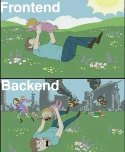
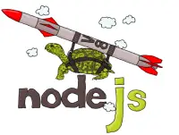
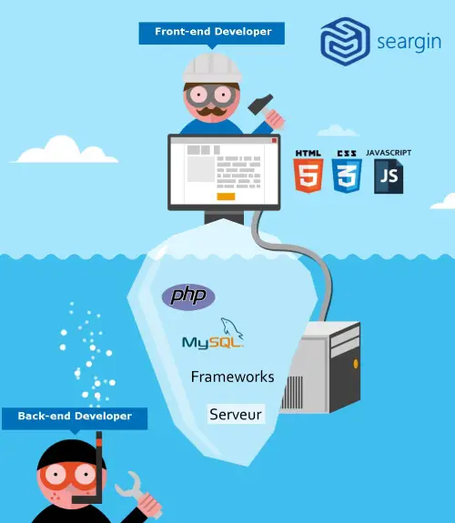

# 03 - Préparez le "front"
  

   
```
|-- projets-node
        |-- projet-3
            |-- .gitignore
            |-- frontend
                |-- node_modules
                |-- package.json
                |-- index.html
```

```
npm init
```
point d'entré index.html
## Installation du package http-server
   

Nous allons installer **http-server** pour lancer le "front" sur un serveur **HTTP**

https://www.npmjs.com/package/http-server
```
npm i http-server
```

Ajouter __**manuellement**__ au json
```json

    "scripts": {
        "start": "npx http-server . -p 4200 -P \"http://localhost:4200?\"" 
    }
```
**ici** :

```json
{
    "name": "go-fullstack-v3-fr",
    "version": "1.0.0",
    "description": "",
    "main": "index.html",
    "scripts": {
        "start": "npx http-server . -p 4200 -P \"http://localhost:4200?\""
    },
    "author": "",
    "license": "ISC",
    "dependencies": {
        "http-server": "^14.1.1"
    }
}
```
**index.html**
```html
<button onclick="qui()">
    Qui est Brad
</button>
<h1></h1>

<script>
    async function qui(){
        const r = await fetch('http://localhost:3000/api/brad');
        const data = await r.json();
        console.log(data);
        document.querySelector('h1').innerHTML =data.title;
        document.querySelector('img').setAttribute('src',data.imageUrl);
    }
</script>
```

Lancez le front
```
npm run start
```
http://localhost:4200

  