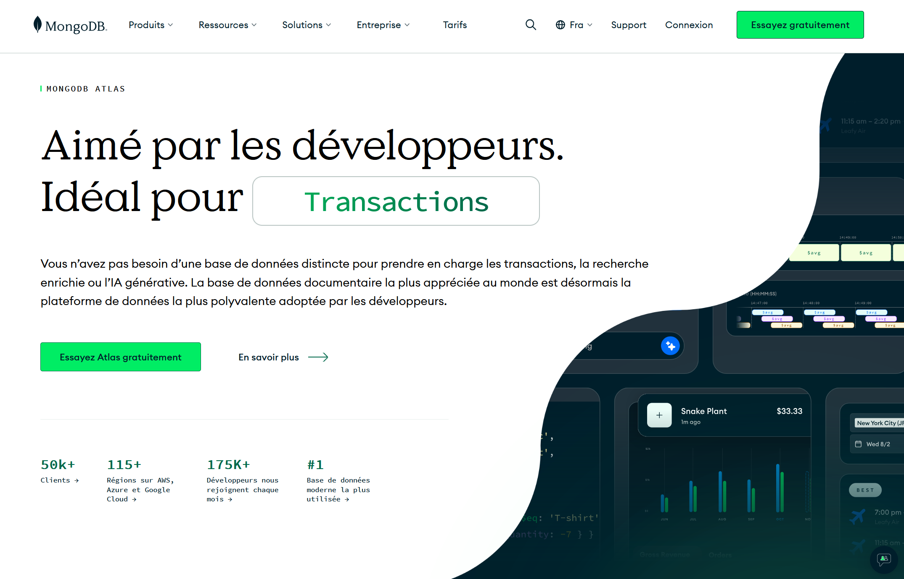
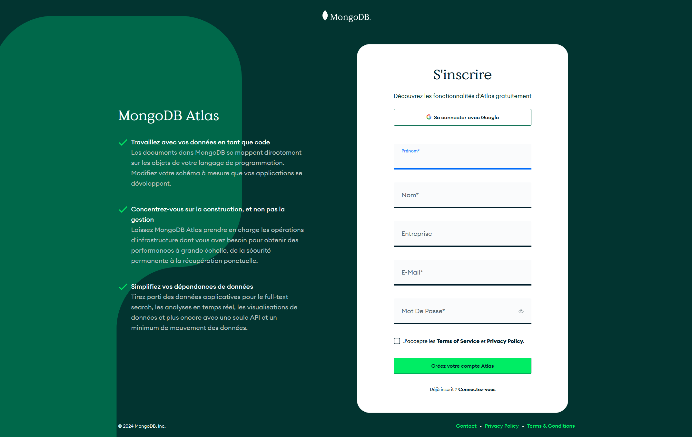
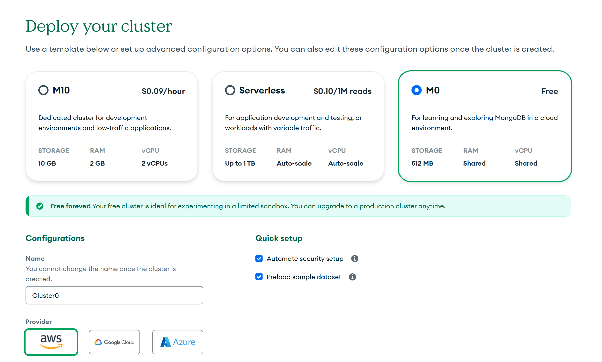
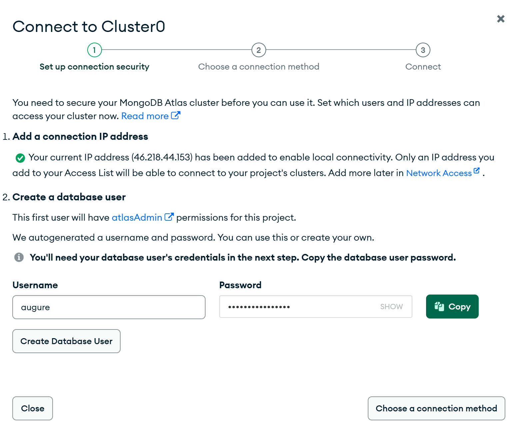
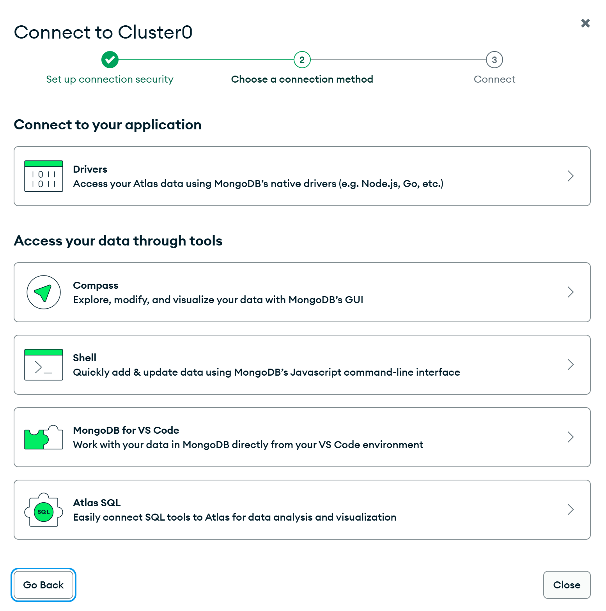

# Installation de MongoDB
  
  
## 1 -Site MongoDB
Nous allons créer une base mongoDB **en ligne**  
[MongoDB](https://www.mongodb.com/fr-fr)  
  

## 2 - Site MongoDB
Cliquez sur "Essayer gratuitement"  
  

## 3 - Choix du cluster
Cliquez sur le cluster **free**  
 

## 4 - Configurez la connexion
Notez votre mot de passe.    

## 5 - Choix de la méthode de connexion
Cliquez sur **Driver** : le premier.    
